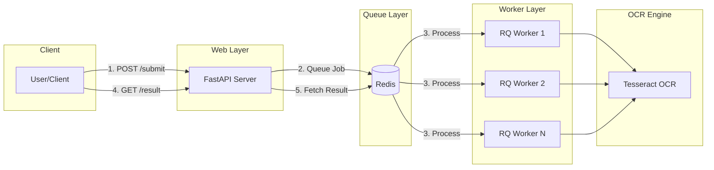

# OCR Processing API

[](https://github.com/adamjgt/API-project/actions/workflows/ci.yml)

Production-ready OCR API with async job queue processing using Redis and RQ.

## Problem Statement

Extracting text from images and PDFs is a computationally expensive operation that can block web servers and cause timeouts. This API solves this by:

- **Async Processing**: OCR jobs are queued and processed by dedicated workers
- **Scalable Architecture**: Horizontal scaling of workers for high throughput
- **Robust Error Handling**: Graceful handling of corrupt files, timeouts, and failures
- **Production Ready**: Structured logging, health checks, and monitoring support

## Architecture



## OCR Flow

1. **Submit**: Client uploads file to `/api/v1/ocr/submit`
2. **Validate**: Server validates file type (PNG/JPG/PDF) and size (≤10MB)
3. **Queue**: Job is pushed to Redis queue, `job_id` returned immediately
4. **Process**: RQ worker picks up job, runs Tesseract OCR
5. **Store**: Result stored in Redis with 24h TTL
6. **Poll**: Client polls `/api/v1/ocr/result/{job_id}` until complete

## Endpoints

| Method | Endpoint | Description |
|--------|----------|-------------|
| `POST` | `/api/v1/ocr/submit` | Submit file for OCR processing |
| `GET` | `/api/v1/ocr/result/{job_id}` | Get OCR job status/result |
| `GET` | `/api/v1/health` | Health check with Redis status |

### Submit Response
```json
{
  "job_id": "abc123-...",
  "message": "Job submitted successfully"
}
```

### Result Response
```json
{
  "status": "finished",
  "text": "Extracted text...",
  "error": null
}
```

Status values: `queued` → `started` → `finished` | `failed`

## Design Decisions

| Decision | Rationale |
|----------|-----------|
| **RQ over Celery** | Simpler setup, Redis-native, sufficient for OCR workloads |
| **Sync OCR in Worker** | Tesseract is CPU-bound, async won't help. Worker isolation is key |
| **Per-page Timeout** | Prevents single bad page from blocking entire job |
| **24h Result TTL** | Balance between storage and retry window |
| **Non-root Docker** | Security best practice for production containers |

## Error Handling

| Error Type | Handling |
|------------|----------|
| Invalid file type | 400 Bad Request with message |
| File too large | 400 Bad Request (limit: 10MB) |
| PDF encrypted | Job fails with descriptive error |
| PDF corrupt | Job fails with descriptive error |
| OCR timeout | Page marked as timeout, continues next |
| Redis unavailable | 503 Service Unavailable |
| Rate limit exceeded | 429 Too Many Requests |
| Invalid/missing API key | 401 Unauthorized |

## Security Features

### Rate Limiting

Protects against abuse and DoS attacks:

```bash
# Default: 10 requests per minute per IP
# Configurable via environment variables:
RATE_LIMIT_ENABLED=true
RATE_LIMIT_REQUESTS=10
RATE_LIMIT_WINDOW=minute
```

Response when limit exceeded:
```json
{
  "error": "Rate limit exceeded",
  "detail": "Too many requests. Limit: 10 per 1 minute",
  "retry_after": 60
}
```

### API Key Authentication

Secure access control for production:

```bash
# Enable and configure API keys:
API_KEY_ENABLED=true
API_KEYS=key1,key2,key3
API_KEY_HEADER=X-API-Key
```

Usage:
```bash
curl -X POST "http://localhost:8000/api/v1/ocr/submit" \
  -H "X-API-Key: your-api-key-here" \
  -F "file=@document.pdf"
```

Generate secure API keys:
```bash
python -c "import secrets; print(secrets.token_urlsafe(32))"
```

### Self-Service API Key Registration

Developers can register and get their own API keys:

| Endpoint | Method | Description |
|----------|--------|-------------|
| `/api/v1/auth/register` | POST | Register & get API key |
| `/api/v1/auth/stats` | GET | View usage statistics |
| `/api/v1/auth/regenerate` | POST | Generate new API key |
| `/api/v1/auth/revoke` | POST | Deactivate API key |

**Register:**
```bash
curl -X POST "http://localhost:8000/api/v1/auth/register" \
  -H "Content-Type: application/json" \
  -d '{"email": "dev@example.com", "name": "John Doe"}'

# Response:
# {
#   "email": "dev@example.com",
#   "name": "John Doe",
#   "api_key": "abc123...",  ← Save this!
#   "message": "API key generated successfully..."
# }
```

**Check Stats:**
```bash
curl "http://localhost:8000/api/v1/auth/stats" \
  -H "X-API-Key: your-api-key"

# Response:
# {
#   "email": "dev@example.com",
#   "request_count": 42,
#   "last_used_at": "2024-01-15T10:30:00"
# }
```

## Scaling Strategy

```
┌──────────────────────────────────────────────────────┐
│                    Load Balancer                      │
└──────────────────────────────────────────────────────┘
         │                    │                    │
    ┌────▼────┐          ┌────▼────┐          ┌────▼────┐
    │  Web 1  │          │  Web 2  │          │  Web N  │
    └────┬────┘          └────┬────┘          └────┬────┘
         │                    │                    │
         └────────────────────┼────────────────────┘
                              │
                       ┌──────▼──────┐
                       │    Redis    │
                       └──────┬──────┘
                              │
    ┌─────────────────────────┼─────────────────────────┐
    │                         │                         │
┌───▼───┐               ┌─────▼─────┐               ┌───▼───┐
│Worker1│               │ Worker 2  │               │WorkerN│
└───────┘               └───────────┘               └───────┘
```

- **Web**: Stateless, scale horizontally based on request volume
- **Workers**: Scale based on queue depth and processing time
- **Redis**: Single instance for moderate load, Redis Cluster for high availability

## Local Development

### Prerequisites
- Python 3.11+
- Docker (for Redis)
- Tesseract OCR
- Poppler Utils (for PDF)

### Setup

```bash
# Clone and setup
git clone <repo>
cd API-project

# Create virtual environment
python -m venv .venv
.venv\Scripts\activate  # Windows
source .venv/bin/activate  # Linux/Mac

# Install dependencies
pip install -r requirements.txt

# Start Redis
docker run -d -p 6379:6379 --name redis redis:alpine

# Copy environment config
copy .env.example .env  # Windows
cp .env.example .env    # Linux/Mac
```

### Run Services

```bash
# Terminal 1: Start API server
uvicorn app.main:app --reload

# Terminal 2: Start RQ worker
rq worker --url redis://localhost:6379 default
```

### Run Tests

```bash
pytest test/ -v
```

## Railway Deployment

### 1. Create Services

Create two services in Railway:
- **Web Service**: Runs the FastAPI application
- **Worker Service**: Runs the RQ worker

### 2. Add Redis

Add Redis from Railway's plugin marketplace.

### 3. Configure Environment Variables

Set for both web and worker services:

```
REDIS_URL=redis://<railway-redis-url>
ENV=production
MAX_FILE_SIZE_MB=10
MAX_PDF_PAGES=20
```

### 4. Configure Start Commands

**Web Service:**
```
uvicorn app.main:app --host 0.0.0.0 --port $PORT
```

**Worker Service:**
```
rq worker --url $REDIS_URL default
```

### 5. Deploy

Push to your connected Git repository. Railway auto-deploys on push.

## Configuration

| Variable | Default | Description |
|----------|---------|-------------|
| `REDIS_URL` | `redis://localhost:6379` | Redis connection URL |
| `MAX_FILE_SIZE_MB` | `10` | Maximum upload size in MB |
| `MAX_PDF_PAGES` | `20` | Maximum PDF pages to process |
| `OCR_TIMEOUT_PER_PAGE` | `10` | Timeout per page in seconds |
| `RESULT_TTL` | `86400` | Job result TTL in seconds (24h) |
| `ENV` | `development` | Environment mode |

## API Documentation

Interactive API documentation available at:
- Swagger UI: `http://localhost:8000/docs`
- ReDoc: `http://localhost:8000/redoc`
